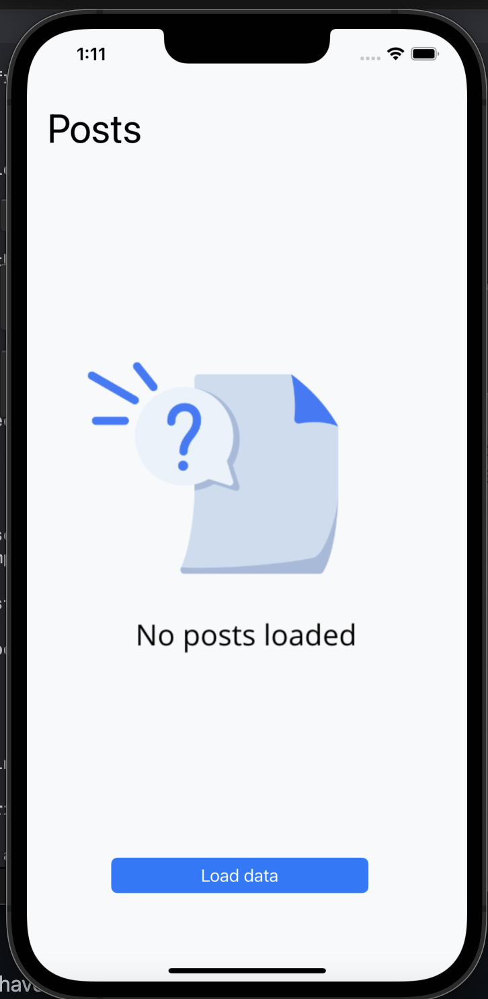
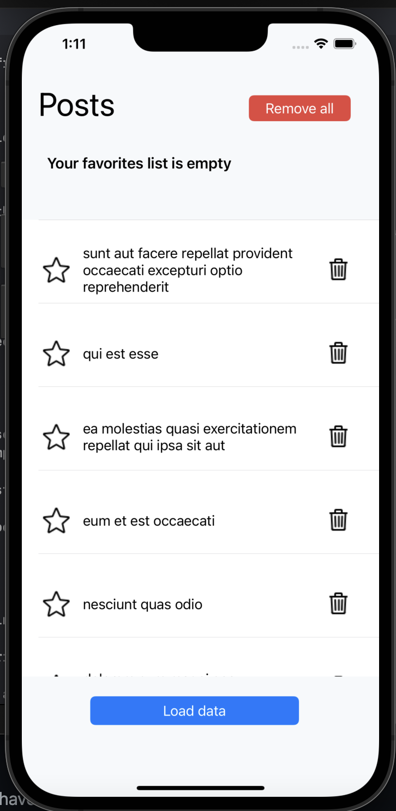
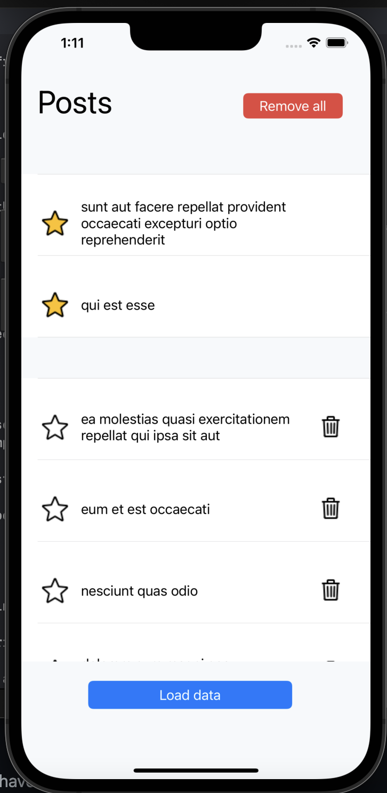
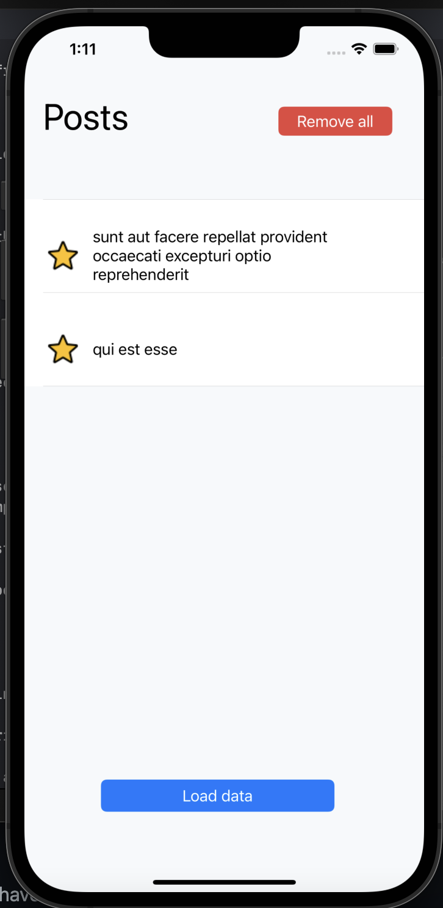
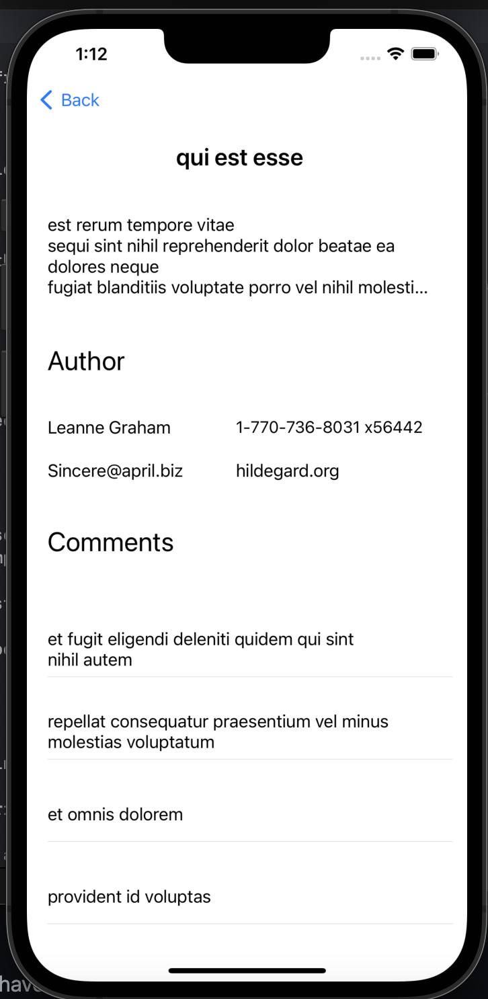

# zemoga-assesment

This is an app that lists data from JSONPlaceholder API.

### Instructions

To run the app you have tod follow the next steps:

1. Clone the repository in your device
2. Open the .xcodeproj file
3. Choose iPhone 13 Pro Max in the simulators section
4. Run the app 

### Features

1. Load posts from API

When running the app you will see a screen with the button "Load data" that allows you to load the data from the API

2. See post details

Once a Post is tapped you will see the details of the post in a new screen (title, description, author's name, author's email, author's company, author's phone number and the list of comments)

3.   Favorite / unfavorite a post

You can click on the star to choose a post as favorite and you will see it in the list of favorites, you can unselected too as favorite

4. Delete a post

You can delete a post clicking in the gargbage icon

5. Remove all posts except favorites

You can click the button remove all to delete all the posts except the favorite ones

### Pictures

### Notes

This app was designed in a simple way in order to show the data in a easy and efficient way. The list of posts is showed in a UITableView which is the best way to show lists in iOS but is not contained within a UITableViewController because there are customized details like buttons and labels in the same view which is better in a UIViewController. To manage the favorites list the app is using two different data sources based on array data structure but the same UITableView and those are separated through sections. The storage strategy used is in-memory storage which is very good for simple data schemas like this one cause it's easy and quick but if we were working with bigger or more complex data, another strategy should be used to present the information in an efficient way. In addition the GUI of the app was designed for the lasts vetrsions of iPhone but is not optimized for every iPhone device so this app looks better in iPone 13 and 12 versions.

 
